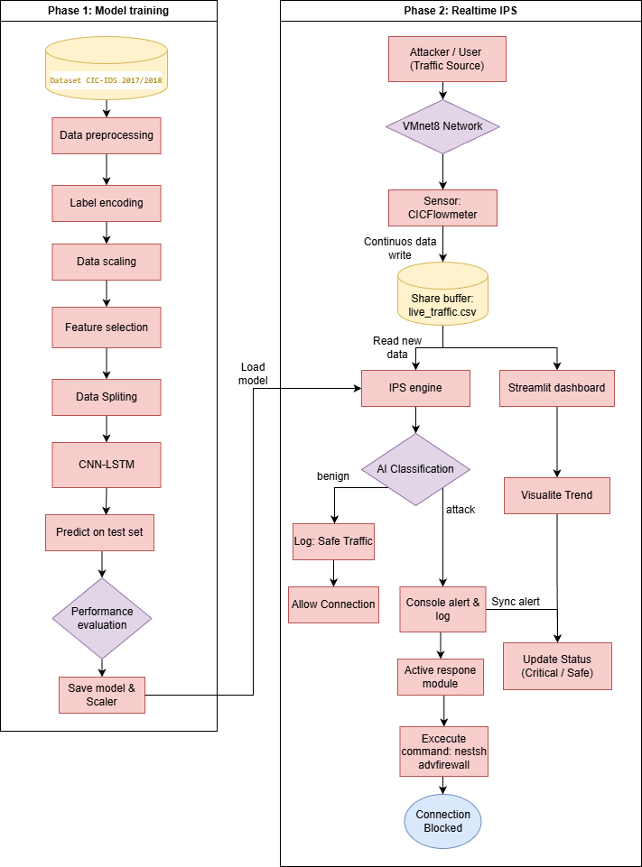
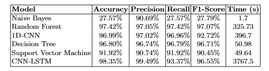
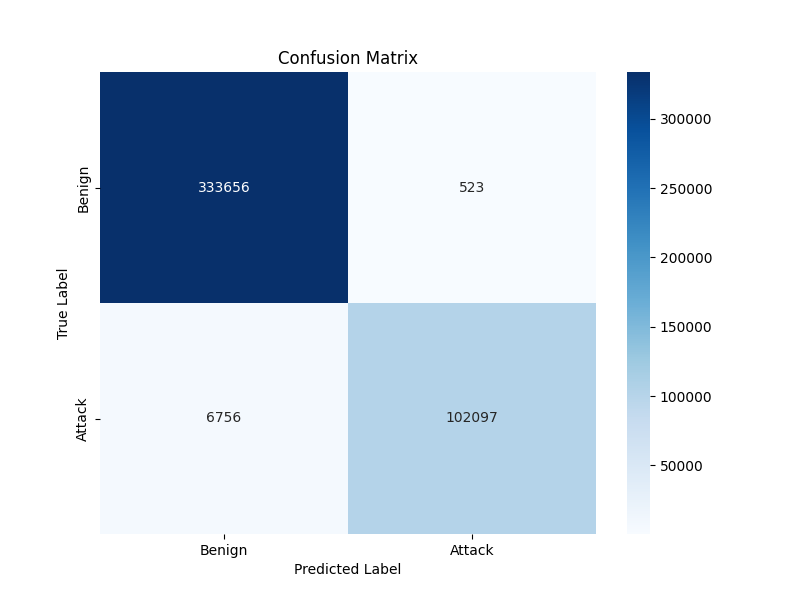
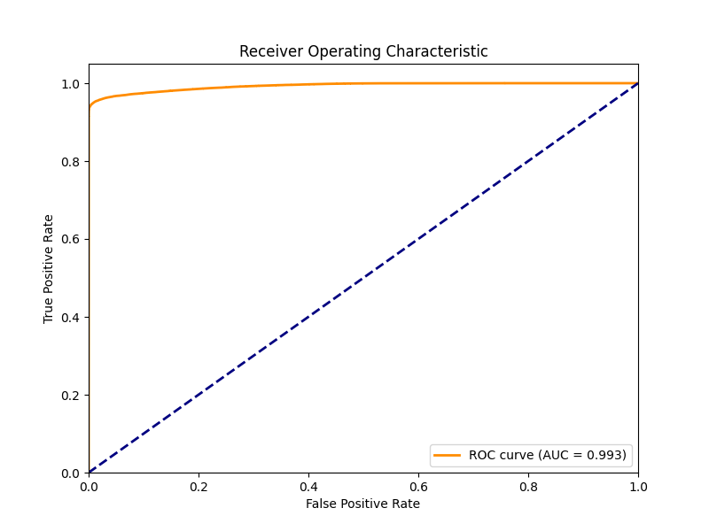
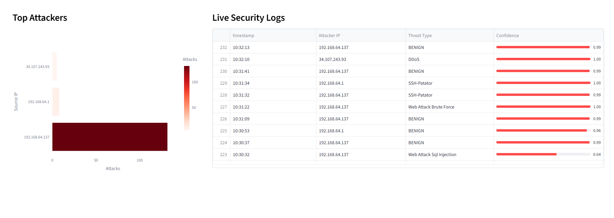
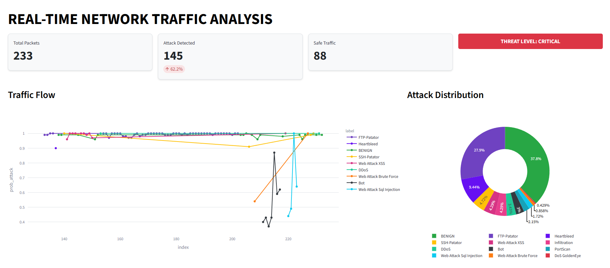

# Real-Time AI-Driven Intrusion Prevention System (IPS)

This repository contains the implementation of a comprehensive, real-time Intrusion Prevention System (IPS) that integrates Deep Learning with automated active defense. The system utilizes a Hybrid CNN-LSTM architecture to detect zero-day threats, Distributed Denial of Service (DDoS), and automated scanning attacks with sub-second latency.

## System Architecture

The system operates as a closed-loop pipeline, ensuring full automation from data acquisition to threat mitigation in both training phase and real-time inference.



## Features & Capabilities

* **Hybrid Deep Learning Engine:** Combines 1D-CNN for spatial feature extraction (e.g., packet size, TCP flags) and LSTM for analyzing temporal sequences of network flows.
* **Real-time Active Mitigation:** Unlike passive IDS, this system incorporates an Active Response Module that directly interfaces with the Windows Firewall API via Python subprocesses to autonomously block malicious attacker IPs.
* **End-to-End Pipeline:** Fully automated workflow from raw packet capture using CICFlowMeter to feature normalization using Z-score ($z=\frac{x-\mu}{\sigma}$) and AI inference.

## Dataset

The model is trained and evaluated on modern benchmark datasets to ensure realistic class imbalance scenarios and modern attack topologies:
* **CIC-IDS2017**
* **CSE-CIC-IDS2018**

## Performance Evaluation

Evaluated using a 5-fold cross-validation strategy, the Hybrid CNN-LSTM model outperformed traditional ML algorithms (Random Forest, SVM, Decision Tree).



### Model Analysis: Confusion Matrix & ROC Curve

The model demonstrates exceptional capability in distinguishing between normal traffic and various attack vectors with minimal misclassification, maintaining a high Area Under the Curve (AUC = 0.993).





## Real-Time Forensic Dashboard

To address the "black box" nature of AI systems, a Streamlit-based Dashboard provides actionable intelligence, real-time alerting, and situational awareness for network administrators.

### Traffic Flow & Attack Distribution


### Top Attackers & Live Security Logs


## Installation & Usage

```bash
git clone [https://github.com/your-username/hybrid-ai-ips.git](https://github.com/your-username/hybrid-ai-ips.git)
cd hybrid-ai-ips
pip install -r requirements.txt

# Start the Streamlit Dashboard and IPS Engine
python src/main.py
